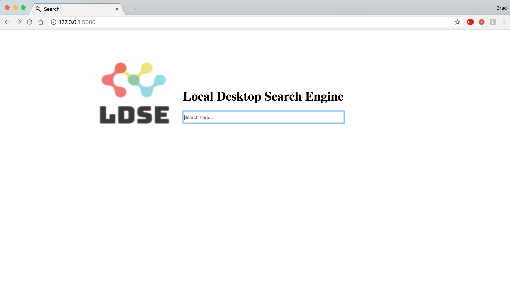
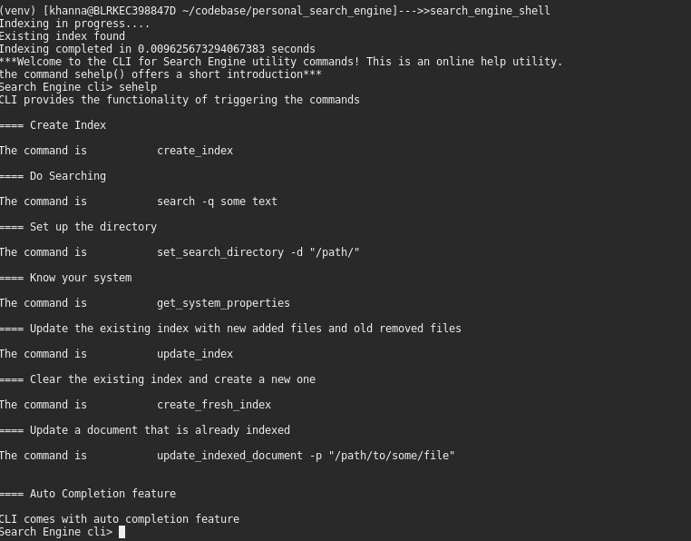
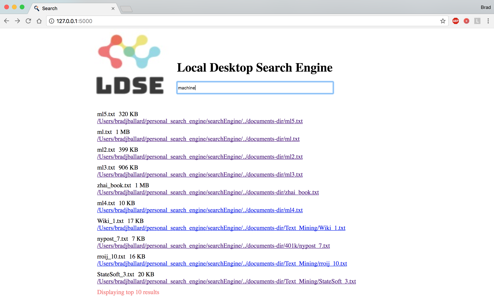

# Local Desktop Search Engine (LDSE)

Organizing data on a computer is a difficult job, and in most cases is the sole responsibility of the user. However, even the most organized user may find it nearly impossible to arrange their files in a way that makes it easy to find information. Because the underlying file systems offer only one way of organizing information, users must resort to special tools to search for what they want. The problem is that most search tools can be slow and limited in how they do their search.

This project intends to make a system that not only ranks documents/texts based upon the scorer but also generates useful information about the document. An existing tool that we build from is a python based library called Whoosh. Whoosh is a fast full-text indexing and searching library with many features, implemented in pure Python. Programmers can use it to easily add search functionality to their applications and websites.


[Overview of LDSE](wiki/Overview.md)

[Technology Review](wiki/tech-review.md)

## Getting Started

The instructions that follow will enable you to get the project up and running on your local machine for development and testing purposes.

### Prerequisites

Python3 must be installed on the system.

### Installing

You can install the product in two ways:

1) Using wheel format: Download a copy of the wheel file to your local machine and run following commands:

  - Untar the file using tar -xvf searchEngine_1.0.0.tar
  - pip3 install searchEngine-1.0.0-py3-none-any.whl

Note: Pip distributions may vary on different operating systems. For linux, use pip3; for other operating systems, use pip.

2) Cloning the project from git:

- git clone https://gitlab.com/mohit2008/personal_search_engine.git
- virtualenv venv (if this doesn't work then run pip3 install virtualenv)
- . venv/bin/activate (for Linux/OSX) or venv/bin/activate for windows
- pip install –e (If not installed yet)

Note: We have automated the above steps for linux/OSX, so you can skip these manual commands and execute the following shell script (file will be located in your cloned repository):

```
./create_venv.sh
```

The application comes in 2 interfaces:
- Shell interface (To start the shell use the command 'search_engine_shell')
- GUI/Browser interface (To start the GUI interface use the command 'server_start')

To access the browser interface, launch the application using any browser with http://127:0.0.1:5000. A search screen will appear as seen below:





## Running the application

You can run the system in two ways:

1) Using the shell interface

  You can make use of the shell interface to perform search functionality and to maintain your indexes. The shell comes with many options that can be explored using the 'sehelp()' command. The shell is a very handy interface where you have the option to set the "look up search directory". Once you have selected a lookup directory, you can create indexes and use them in your search.

  ```
  set_search_directory -d "/somepath/"

  create_fresh_index
  ```

After you have completed the two steps above, you will start seeing relevant results in the shell interface or in the browser interface. The shell comes with the following commands:

- 'create_index' : This command will create a index for you, if an existing index is found it will skip the process.
- 'search -q sometext' : This command will perform a search for any text that you give after -q argument.
- 'set_search_directory' : This command will let you configure your look up directory where the searching will be performed.
- 'get_system_properties' : This command will render additional information about your system.
- 'update_index' : This command will intelligently scan your lookup directory to find any newly changed files and add/delete them from index.
- 'create_fresh_index': This command will delete the existing index and create a fresh new one.
- 'update_indexed_document -p "/path/"' : This command will update the index for a file that has been updated after indexing.  




2) Using your browser

Once the product is installed and the server is running, you can search for the documents/files directly on your browser.  You can witness that search engine offers autocorrection and word suggestions based on the words indexed from the files in the selected directory. Note: It's recommended that you first set up your lookup directory using the shell interface described above.




## Built With

* [Whoosh](http://whoosh.readthedocs.io/en/latest/intro.html) - Used for indexing and ranking
* The application uses some of the below packages:

'cmd2>=0.7.5'
'flask>=0.11.1'
'whoosh>=2.7.4'
'requests>=2.18.4'
'python-docx>=0.8.6'
'PyPDF2>=1.26.0'
'bs4>=0.0.1'

However, a user does not have to do a manual installation of all these packages. We have automated the installation using wheel.


## Authors

* **Mohit	Khanna** mohit.khanna2008@gmail.com	(Project Coordinator)

* **Brad Ballard** ballard6@gmail.com, bjb3@illinois.edu

* **Anupama	Agrahari** anupama_agrahari@yahoo.com

## Contributions

We had divided our project mainly into two parts:

Part 1:	Building the search engine – Backend

- Contributors: Mohit Khanna and Anupama Agrahari

- Description: The back-end is comprised of integrating the Whoosh framework to work with local files for which we implemented a scanner that located files from the lookup directory. Each file picked up had to be parsed keeping in mind the different file formats we are supporting for which we needed different parsing libraries. The text extracted then had to be injected into the indexer which ran on 3 threads concurrently to speed up the process of indexing. We have separate modules for performing indexing, searching, front-end, and back-end operations. The searcher will then take in a query and return the results from the indexer by scoring it. This is then fed into a method that extracts all the information about those files from the system.

Careful attention has been given to optimize the process of updating the index whenever there is some changes in your look up directory. This optimization helps to ensure that the users does not need to wait for the entire indexing to happen again for a small change.

We have also generated some helper bash scripts that aided to increase the productivity during development.

The following were the major tasks in the back-end development:

  - a.)	Helper Script (create_venv.sh)

  - b.)	Create package script (create_package.sh)

  - c.)	Indexer

  - d.)	Parser

  - e.)	Get system properties feature


Part 2:	Building the UI - front end

- Contributors: Brad Ballard

- Description: Used Flask framework to connect the Python backend functions with an HTML page. The user interface consists of the title, logo of the application, and a search bar (HTML input element). A favicon image is added to make the web page recognizable among other browser tabs.
An app route was created for a Python function that accepts a string argument and calls our search ranker to receive search results. JavaScript was used to make an HTTP GET request to this backend function on each user input event (e.g. type, delete, or copy/paste) within the search bar, with this user input being sent as part of the URL. The function then returns the following search results: names, locations, sizes of the files found, the number of results, and the suggested correction for search terms if nothing is found. When a response is received from the GET request, JavaScript code gets executed, updating the HTML page dynamically to display the results in a user-friendly format.

## License

This project is licensed under the University of Illinois/NCSA Open Source License  - see the [LICENSE.md](LICENSE.md) file for details.
